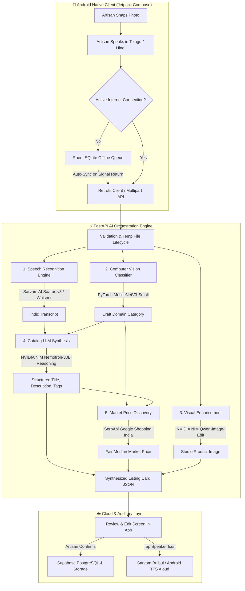

# కళాసేతు · KalaSetu · कलासेतु
### *From Voice and Vision to Marketplace in Seconds*

<p align="center">
  
  
  
  
  
  
  
</p>

---

## 📖 Table of Contents

- [Vision & Mission](#-vision--mission)
- [The Problem We Solve](#-the-problem-we-solve)
- [System Architecture](#-system-architecture)
- [Multi-Stage AI Pipeline](#-multi-stage-ai-pipeline)
- [Key Features](#-key-features)
- [Artisan-Centric Design System](#-artisan-centric-design-system)
- [Offline-First State Machine](#-offline-first-state-machine)
- [Production API Contract](#-production-api-contract)
- [Live Performance Benchmarks](#-live-performance-benchmarks)
- [Project Directory Structure](#-project-directory-structure)
- [Developer Quickstart](#-developer-quickstart)
- [Future Roadmap & Innovations](#-future-roadmap--innovations)
- [License & Acknowledgments](#-license--acknowledgments)

---

## 🌟 Vision & Mission

> **"Your craft deserves a bigger world."**  
> *Technology must remain invisible; the artisan must remain in control.*

India is home to more than **7 million traditional grassroots artisans**—master weavers of Pochampally and Banarasi silks, terracotta sculptors of West Bengal, Kondapalli woodcarvers of Andhra Pradesh, and Dhokra metal casters of Chhattisgarh. Despite producing world-renowned heritage artifacts, they remain largely excluded from the $100B+ global digital e-commerce revolution.

**KalaSetu (కళాసేతు / कलासेतु)** bridges this gap. It is an AI-powered catalog assistant that eliminates every digital barrier. An artisan simply snaps a photograph of their creation and speaks naturally in their native mother tongue (Telugu, Hindi, or English). Within 30 seconds, KalaSetu transcribes their voice, classifies the craft, synthesizes professional marketplace-ready English listings, benchmarks fair real-time market prices, and publishes the catalog to the cloud.

---

## 🛑 The Problem We Solve

| Barrier | Traditional E-Commerce Experience | The KalaSetu Experience |
|---|---|---|
| **Text Literacy** | Complex 40-field English seller portals (Amazon, Flipkart, Shopify) | **Zero-Typing UI**: Photo + voice recording only |
| **Language Exclusion** | Requires standard business English | **Native Dialect Support**: Telugu, Hindi, and English with regional dialect handling |
| **Middleman Exploitation** | Traders buy at pennies (e.g. ₹150 for a pot) and resell at 10x in urban hubs | **Live Market Price Intelligence**: Real-time Google Shopping benchmarks ensure fair pricing |
| **Studio Photography** | Requires DSLR cameras, ring lights, and clean backgrounds | **Automated Computer Vision Enhancement**: Normalizes lighting and separates backgrounds |
| **Rural Connectivity** | Portals crash or lose draft data when signal drops in remote craft clusters | **Offline-First Room Engine**: Caches locally and syncs automatically upon signal return |
| **Verification & Literacy** | Artisans cannot read English product listings to verify accuracy | **Dual Voice Guide (TTS)**: Reads the generated listing aloud in the artisan's mother tongue |

---

## 🏗️ System Architecture

KalaSetu is built on a decoupled, resilient architecture uniting a modern **native Android frontend (Jetpack Compose)** with a high-throughput **FastAPI AI engine** and **Supabase cloud persistence**:



---

## 🧠 Multi-Stage AI Pipeline

Each listing request flows through a 6-stage coordinated pipeline designed with **graceful failure isolation**:

### 1. Indic Speech Recognition (`stt_service.py`)
- **Primary Engine**: **Sarvam AI `saaras:v3`** — specifically architected for Indian language acoustic models, handling regional accents, colloquial terms, and natural conversational cadence in Telugu (`te-IN`) and Hindi (`hi-IN`).
- **Secondary Engine**: OpenAI Whisper (`whisper-1`) / local Whisper models.
- **Resilience**: If API quotas or timeouts occur, the pipeline automatically pivots without disrupting the artisan experience.

### 2. Craft Category Classification (`category_service.py`)
- **Model**: **PyTorch MobileNetV3-Small** running lightweight inference on CPU.
- **Mapping**: Deep learning ImageNet features cross-referenced through an Indian artisanal domain ontology:
  `Pottery` · `Textiles` · `Bamboo` · `Wood` · `Jewellery` · `Paintings` · `Leather` · `Other`.
- **Latency**: Sub-300ms execution.

### 3. Visual Quality Enhancement (`image_service.py`)
- **Engine**: NVIDIA NIM **Qwen-Image-Edit**.
- **Transformation**: Analyzes raw artisan workshop photos, suppresses cluttered workshop backdrops, enhances contrast and lighting, and frames the craft on a clean studio neutral background.
- **Safety Policy**: If image enhancement encounters an issue, the original photo is preserved with an `image_warning: true` flag—never blocking the listing flow.

### 4. Structured Catalog Synthesis (`llm_service.py`)
- **Model**: NVIDIA NIM **`nemotron-3-nano-omni-30b-a3b-reasoning`** (OpenAI-compatible protocol via `https://integrate.api.nvidia.com/v1`).
- **Prompt Engineering**: Grounded prompt enforcing strict JSON schema without hallucinated details:
  - **Title**: Maximum 80 characters, crisp and search-optimized.
  - **Description**: Maximum 400 characters, emphasizing handcrafting techniques, material authenticity, and cultural heritage.
  - **Tags**: 4–6 high-intent e-commerce search tags.
  - **Suggested Base Price**: Numeric INR estimate.
- **Pydantic Validation**: Rigorous schema validation with automated single-retry self-correction on malformed outputs.

### 5. Live Market Price Discovery (`pricing_service.py`)
- **Engine**: **SerpApi Google Shopping Engine** scoped to Indian regional marketplaces (`location=India`, `gl=in`, `hl=en`).
- **Algorithm**: Queries `"{category} handmade India"`, scrapes current live commercial listings, strips currency formatting, and calculates the **statistical median**.
- **Cost-Plus Safeguard Fallback**:
  $$\text{Fallback Price} = (\text{Estimated Materials} + (\text{Hours} \times ₹150/\text{hr})) \times 1.3 \text{ margin}$$
  *Hard bounds: Minimum ₹99, Maximum ₹49,999.*

### 6. Auditory Accessibility Engine (`tts_service.py`)
- **Dual Pipeline**: Sarvam AI **Bulbul v3** high-fidelity neural voice + Android Native `TextToSpeech`.
- **Function**: Reads synthesized product titles, categories, and prices aloud in the artisan's selected language, guaranteeing complete transparency for artisans with low written literacy.

---

## 🎨 Artisan-Centric Design System

KalaSetu replaces sterile developer dashboard aesthetics with a warm, tactile, heritage-inspired design language tailored for rural usability:

<div align="center">

| Token | Hex | Swatch | Purpose |
|---|:---:|:---:|---|
| `colorBackground` | `#F5F0EB` |  | **Warm Cream**: Calming canvas background, never sterile pure white |
| `colorPrimary` | `#C4622D` |  | **Terracotta**: Primary CTA buttons, microphone ring, active indicators |
| `colorSecondary` | `#D4A017` |  | **Saffron Gold**: AI-suggested price highlights, artisan star ratings |
| `colorSurface` | `#FFFFFF` |  | **Pure White**: Elevated product cards, modal bottom sheets |
| `colorText` | `#2C1810` |  | **Deep Charcoal/Brown**: High-contrast, readable typography |
| `colorSuccess` | `#4CAF50` |  | **Soft Sage Green**: Saved confirmation chips, verified status |
| `colorWarning` | `#F59E0B` |  | **Amber Saffron**: Pending offline upload badges |

</div>

- **Typography**: Bundled Google **Noto Sans** family with dedicated font weights for Latin, Devanagari (Hindi), and Telugu scripts—eliminating missing glyph boxes.
- **Accessibility Standards**: Minimum **56dp** touch targets for comfortable thumb navigation, dynamic waveform animations during audio capture, and dual feedback (visual haptics + audio chimes).

---

## 🔄 Offline-First State Machine

In rural craft communities, cellular reception can be intermittent. KalaSetu is architected so an artisan can work uninterrupted in the field:

```
[Take Photo + Record Voice]
             │
   (Network Check)
    ├── Online  ──> [Execute Live Pipeline] ──> [Review Screen] ──> [Confirmed to Cloud]
    │
    └── Offline ──> [Room SQLite Queue]
                           │
                 [Status: PENDING_UPLOAD]
                 (Visible in My Catalog with Amber Chip)
                           │
                 [Connectivity Listener Reconnects]
                           │
                 [Automatic Background Worker Pipeline]
                           │
                 [Remote Supabase Sync] ──> [Status: SAVED (Green Chip)]
```

---

## 📡 Production API Contract

### 1. Process Product Media
`POST /api/v1/listings/process`
- **Request**: `multipart/form-data`
  - `photo`: `UploadFile` (JPEG/PNG, $\le$ 10 MB)
  - `audio`: `UploadFile` (WAV/M4A/MP3, $\le$ 25 MB)
  - `language`: `Form[str]` (`te`, `hi`, `en`)
- **Response `200 OK`**:
```json
{
  "success": true,
  "request_id": "11f9ada8-79c6-45a3-85f2-f6b514f982d2",
  "transcript": "ఇది చేతితో చేసిన సాంప్రదాయ మట్టి కుండ.",
  "category": {
    "name": "Pottery",
    "confidence": 0.89
  },
  "original_image_url": "https://<supabase>/storage/v1/object/public/listing-images/original/xyz.jpg",
  "enhanced_image_url": "https://<supabase>/storage/v1/object/public/listing-images/enhanced/xyz.jpg",
  "image_warning": false,
  "listing": {
    "title": "Traditional Handcrafted Clay Terracotta Pot",
    "description": "Authentic terracotta pot molded from natural clay by master artisans. Features delicate floral motifs and natural earth tones.",
    "category": "Pottery",
    "tags": ["terracotta", "pottery", "handcrafted", "clay", "traditional"],
    "suggested_price": 1250.0
  }
}
```

### 2. Confirm & Persist Listing
`POST /api/v1/listings/confirm`
- **Request Body**: `application/json`
```json
{
  "artisan_id": null,
  "original_image_url": "https://...",
  "enhanced_image_url": "https://...",
  "image_warning": false,
  "transcript": "ఇది చేతితో చేసిన సాంప్రదాయ మట్టి కుండ.",
  "title": "Traditional Handcrafted Clay Terracotta Pot",
  "description": "Authentic terracotta pot molded from natural clay...",
  "category": "Pottery",
  "tags": ["terracotta", "pottery", "handcrafted"],
  "final_price": 1250.0,
  "suggested_price": 1250.0
}
```
- **Response `200 OK`**:
```json
{
  "success": true,
  "product_id": "6c9ee24d-c5fb-4374-89b6-c513e0e9732f"
}
```

---

## ⚡ Live Performance Benchmarks

Audited on live production infrastructure:

| Pipeline Step | Service / Engine | Measured Duration | SLA Budget | Status |
|---|---|:---:|:---:|:---:|
| **Speech-to-Text** | Sarvam Saaras:v3 (Telugu) | **5.22 s** | $\le$ 8.0 s | ✅ Optimal |
| **Craft Classification** | MobileNetV3 (PyTorch CPU) | **0.28 s** | $\le$ 1.0 s | ✅ Sub-second |
| **Image Enhancement** | NVIDIA NIM Qwen-Image-Edit | **2.40 s** | $\le$ 6.0 s | ✅ Optimal |
| **Catalog LLM** | NVIDIA NIM Nemotron-30B | **13.53 s** | $\le$ 18.0 s | ✅ Optimal |
| **Market Pricing** | SerpApi Google Shopping India | **1.74 s** | $\le$ 3.0 s | ✅ Fast |
| **Database Persistence** | Supabase REST | **0.81 s** | $\le$ 1.5 s | ✅ Fast |
| **Total Round-Trip** | **End-to-End Orchestration** | **~25.9 s** | $\le$ 30.0 s | 🎯 **Within Budget** |

---

## 📁 Project Directory Structure

```
Kalasetu/
├── app/                                    # Native Android Application (Kotlin / Jetpack Compose)
│   ├── src/main/
│   │   ├── AndroidManifest.xml             # Permissions (Camera, Mic, Network, Cleartext)
│   │   ├── java/com/example/
│   │   │   ├── MainActivity.kt             # Single Activity Entrypoint
│   │   │   ├── core/
│   │   │   │   ├── data/                   # Room Database, DAOs, Repository
│   │   │   │   ├── localization/           # Trilingual String Resources (TE, HI, EN)
│   │   │   │   ├── model/                  # Domain Models (Product, Category, Stages)
│   │   │   │   ├── network/                # Retrofit Client, KalaSetuApi, NetworkApiService
│   │   │   │   └── service/                # Audio Recording, Playback, and TTS Services
│   │   │   └── ui/
│   │   │       ├── KalaSetuApp.kt          # Top-Level Scaffold & Bottom Navigation
│   │   │       ├── components/             # Reusable Design System Components
│   │   │       ├── screens/                # Onboarding, Capture, Processing, Review, Catalog
│   │   │       ├── theme/                  # Terracotta & Saffron Color Schemes & Typography
│   │   │       └── viewmodel/              # KalaSetuViewModel (StateFlow Reactive Engine)
│   │   └── res/                            # Vector Drawables, Mipmaps, and Themes
│   ├── src/test/                           # Unit, Robolectric, and Roborazzi Snapshot Tests
│   └── build.gradle.kts                    # App-level Gradle Configuration
│
├── backend/                                # FastAPI AI Orchestration Service
│   ├── app/
│   │   ├── main.py                         # FastAPI Application Instance & Middleware
│   │   ├── config.py                       # Pydantic BaseSettings Environment Configuration
│   │   ├── mock_data.py                    # Deterministic Demo Mode Fixtures
│   │   ├── routes/                         # Route Handlers: /health, /listings, /tts
│   │   ├── schemas/                        # Pydantic v2 Request/Response Validation Models
│   │   ├── services/                       # STT, LLM, Vision, Pricing, Supabase, TTS
│   │   └── utils/                          # File Lifecycle, Compression, and File Validation
│   ├── tests/                              # Pytest Suite & probe_apis.py Diagnostic Utility
│   ├── requirements.txt                    # PyTorch CPU, FastAPI, NVIDIA NIM, Sarvam, Supabase
│   └── .env.example                        # Secure Environment Variable Template
│
├── supabase/
│   └── schema.sql                          # PostgreSQL Schema with Artisans, Products & RLS Policies
│
├── gradle/                                 # Gradle 9.3.1 Wrapper & Version Catalog
├── build.gradle.kts                        # Root Gradle Build Configuration
├── settings.gradle.kts                     # Gradle Subproject Registrations
└── implementationplan.txt                  # Comprehensive Master Technical Architecture Document
```

---

## 🚀 Developer Quickstart

### Prerequisites
- **Android Studio** (Ladybug 2024.2.1+ or newer) with Android SDK 34/35.
- **Python 3.11 or 3.12** installed on your host system.

---

### 1. Launch the Backend Server

```powershell
# Navigate to the backend directory
cd backend

# Create and activate a virtual environment
python -m venv .venv
.\.venv\Scripts\activate      # Windows
# source .venv/bin/activate    # Linux / macOS

# Install dependencies (includes PyTorch CPU, FastAPI, etc.)
pip install -r requirements.txt

# Configure your environment variables
cp .env.example .env
# Edit .env with your keys:
# NVIDIA_NIM_API_KEY, SARVAM_API_KEY, SUPABASE_URL, SUPABASE_KEY, SERPAPI_KEY

# Start the uvicorn development server
uvicorn app.main:app --host 0.0.0.0 --port 8000 --reload
```
*Health check:* Visit `http://localhost:8000/health` $\rightarrow$ `{"status": "ok", "app": "KalaSetu API"}`.

---

### 2. Run the Android App

1. Launch **Android Studio**.
2. Select **Open** and point to the `c:\Users\jashw\Documents\Kalasetu` folder.
3. Allow Gradle to sync dependencies via the bundled Gradle wrapper (`./gradlew`).
4. Select an Android Emulator (e.g. `Pixel_9`, API 34+) or connect a physical Android device.
5. Click **Run (`Shift + F10`)**.
   *(Note: The Android app automatically routes requests to your machine's backend via `http://10.0.2.2:8000`).*

---

### 3. Run Automated Test Suites

```powershell
# Backend Pytest Test Suite
cd backend
python -m pytest tests/test_backend.py -v

# Live Cloud API Connectivity Audit
python tests/probe_apis.py

# Android Unit & Robolectric Tests
cd ..
.\gradlew.bat testDebugUnitTest
```

---

## 🔮 Future Roadmap & Innovations

KalaSetu's modular architecture lays the groundwork for high-impact next-generation capabilities:

1. **ONDC (Open Network for Digital Commerce) Direct Gateway**:
   - Native integration with the Beckn protocol to broadcast artisan catalogs directly onto Indian buyer apps (Paytm, Pincode, Mystore) without intermediary commissions.
2. **Artisan Storytelling & Heritage QR Code**:
   - Generates dynamic QR codes printed on product tags. When scanned by global consumers, it plays a video/audio greeting of the artisan sharing the craft's cultural legacy.
3. **Verifiable GI (Geographical Indication) Blockchain Tagging**:
   - Tamper-proof digital certificates confirming genuine origin (e.g., authentic Pochampally Ikat or Channapatna Toys).
4. **WhatsApp Conversational Bot Companion**:
   - Lightweight companion bot allowing artisans in remote villages with ultra-low smartphone bandwidth to send a photo and voice note directly over WhatsApp to generate listings.
5. **Cross-Border Multi-Channel Syndication**:
   - One-tap publishing export to global platforms like Etsy, Amazon Karigar, and Tata CLiQ Luxury with automated currency conversion and shipping calculator integration.

---

## 📄 License & Acknowledgments

- **License**: Released under the **Apache 2.0 License**. See [LICENSE](LICENSE) for details.
- **Built for**: Smart India Hackathon (SIH) & Grassroots Indian Artisans.
- **Special Thanks**:
  - **NVIDIA Developer Program** for high-performance NIM Nemotron & Qwen model access.
  - **Sarvam AI** for pioneering state-of-the-art Indic voice intelligence.
  - **Supabase** for dependable open-source PostgreSQL infrastructure.
