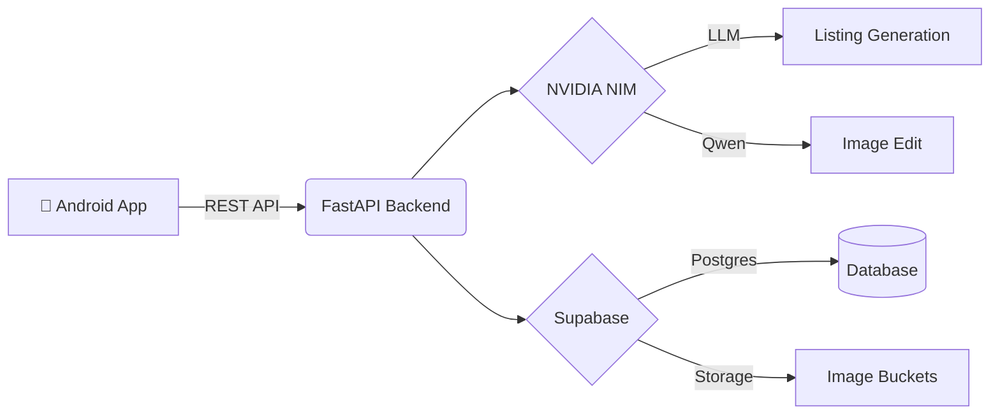

<p align="center">
  
</p>

<h1 align="center">KalaSetu</h1>
<p align="center">
  <strong>Empowering Indian Artisans with AI-Driven Digital Commerce</strong>
</p>

<p align="center">
  <a href="#features">Features</a> •
  <a href="#architecture">Architecture</a> •
  <a href="#getting-started">Getting Started</a> •
  <a href="#ai-integration">AI Integration</a> •
  <a href="#security--privacy">Security</a>
</p>

<p align="center">
  
  
  
  
  
</p>

---

**KalaSetu** is a modern artisan catalog mobile application built for Android. It bridges the gap between traditional Indian craftsmanship and modern e-commerce. By leveraging Voice-to-Text and cutting-edge Generative AI, KalaSetu enables artisans with limited digital literacy to create highly professional online product listings in seconds.

Simply snap a photo, speak about the product in your native language (Telugu, Hindi, or English), and let KalaSetu's AI pipeline generate a rich, market-ready listing.

## ✨ Features

### 🛍️ Artisan-First Catalog Management
- **Smart Dashboard:** View real-time local catalog metrics and recent listings.
- **Robust Organization:** Filter by category/status, sort, and manage product details easily.
- **Offline-First Resilience:** Network drops? No problem. KalaSetu saves drafts via Room Database and features an offline processing queue with automatic background sync.
- **Fail-Safe Publishing:** AI processes produce a *draft*. KalaSetu **never** publishes to the live marketplace without explicit artisan review and confirmation.

### 🤖 AI-Powered Workflow (FastAPI Backend)
- **Generative Copywriting:** NVIDIA NIM / OpenAI models synthesize your voice notes into compelling, professional descriptions and tags.
- **Image Enhancement:** Original product photos are analyzed and enhanced (Qwen-Image) for a premium e-commerce look.
- **Market Pricing:** Real-time SerpApi Google Shopping integration suggests fair, competitive market pricing to guide the artisan.
- **Multilingual Support:** Built-in Sarvam/Whisper transcription translates local Indic languages to English.

### ♿ Accessibility & Inclusivity
- **Adaptive UI:** Full support for system Light/Dark mode, dynamic text scaling, and high-contrast modes.
- **Text-to-Speech (TTS):** App can read generated listings aloud using device TTS or Google TTS, ensuring artisans can review AI outputs regardless of reading ability.

## 🏗️ Architecture



## 🚀 Getting Started

Follow these instructions to run the full stack locally.

### 1. Prerequisites
- **Android:** JDK 21 and Android SDK 36.
- **Python:** Python 3.10+ for the backend.
- **Database:** Supabase project or local Docker instance.

### 2. Backend Setup
Initialize your Python environment and start the server:

```bash
cd backend
python -m venv .venv
.\.venv\Scripts\activate  # Windows
pip install -r requirements.txt

# Configure environment secrets
cp .env.example .env
# Edit .env with your Supabase and NVIDIA API keys. NEVER commit this file!

# Start the API server
python -m uvicorn app.main:app --host 0.0.0.0 --port 8000
```

### 3. Database Migration
1. Execute `supabase/schema.sql` to initialize tables.
2. Execute `supabase/product_expansion.sql` for additive updates.
3. *Note: Ensure your `listing-images` storage bucket is set to Public for image rendering.*

### 4. Android App Setup
Open the app folder in Android Studio, or build via Gradle:

```bash
.\gradlew.bat assembleDebug
```
*Note: Debug builds default to the emulator IP (`http://10.0.2.2:8000/`). To run on a physical device, pass your LAN IP via `-PBACKEND_URL`.*

## 🔒 Security & Privacy

- **Data Minimization:** Local insights are calculated on-device. Buyer views, orders, and sales are strictly isolated.
- **Anonymization:** Owner hashes, private transcripts, and emails are never exposed. Phone numbers are hidden unless explicitly toggled public.
- **Row Level Security (RLS):** All Supabase queries are protected by strict RLS and authenticated RPCs. 
- **Ephemeral Processing:** Voice transcripts and original images are temporarily processed and securely dropped after listing generation if configured.

## 🧪 Testing

```bash
# Android
.\gradlew.bat testDebugUnitTest lintDebug

# Backend (Pytest)
cd backend
pytest tests/ -q
```
