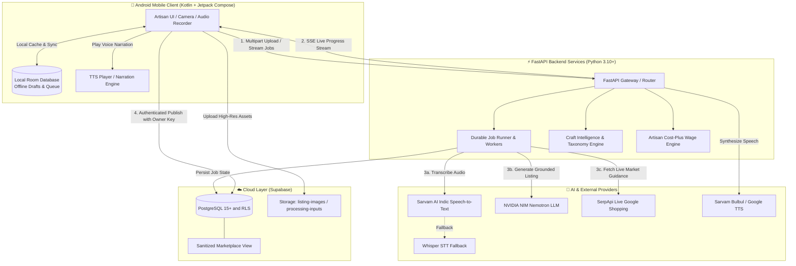

<p align="center">
  
</p>

<h1 align="center">KalaSetu 🇮🇳 (कला सेतु / కళాసేతు)</h1>
<p align="center">
  <strong>Bridging the Gap Between Indian Artisans and the Digital Marketplace with Multimodal Voice-First AI</strong>
</p>

<p align="center">
  <em>Smart India Hackathon Project • Problem Statement: SIH26090</em>
</p>

<p align="center">
  <a href="#-download-apk"></a>
  
  
  
  
  
  
  
</p>

<p align="center">
  <a href="#-download-apk">Download APK</a> •
  <a href="#-the-problem--our-solution">Problem & Solution</a> •
  <a href="#-core-features">Core Features</a> •
  <a href="#-system-architecture">Architecture</a> •
  <a href="#-api-reference">API Reference</a> •
  <a href="#-tech-stack-matrix">Tech Stack</a> •
  <a href="#-getting-started">Getting Started</a> •
  <a href="#-database-setup">Database Setup</a> •
  <a href="#-security-privacy--responsible-ai">Security & Responsible AI</a> •
  <a href="#-testing--verification">Testing</a>
</p>

---

## 📱 Download APK

Want to test **KalaSetu** immediately on your Android smartphone? A pre-compiled debug APK is available directly in this repository:

<p align="center">
  <a href="release/kalasetu-app-debug.apk?raw=true">
    
  </a>
  &nbsp;&nbsp;
  <a href="https://github.com/jashwanthkandhi/KalaSetu/releases">
    
  </a>
</p>

### 📦 APK Specifications
| Specification | Value |
| --- | --- |
| **Package ID** | `com.aistudio.kalasetu.vmbk` |
| **Version** | `v2.0` (VersionCode `1`) |
| **Direct Path** | [`release/kalasetu-app-debug.apk`](release/kalasetu-app-debug.apk?raw=true) |
| **File Size** | ~24.5 MB |
| **Compatibility** | Android 7.0 (API 24 - Nougat) through Android 15 (API 36) |
| **Supported Languages** | English, Hindi (हिंदी), Telugu (తెలుగు) |

### 📲 Quick Install Guide for Android:
1. **Download:** Tap the green download button above directly from your Android browser (or download on PC and transfer to your device).
2. **Open:** Open the downloaded `.apk` file from your device notifications or via your **Files / Downloads** app.
3. **Allow Unknown Sources:** If prompted with *"For your security, your phone is not allowed to install unknown apps from this source"*, tap **Settings** and toggle **"Allow from this source"**.
4. **Complete Installation:** Tap **Install**, then launch **KalaSetu**!

> [!NOTE]
> **Backend Networking for Physical Devices:**
> The pre-compiled debug APK targets `http://10.0.2.2:8000/` by default (the standard Android Emulator loopback). If you run the backend on a local PC and test on a physical Android device over Wi-Fi, build the APK with your computer's LAN IP:
> ```bash
> .\gradlew.bat assembleDebug -PBACKEND_URL="http://192.168.x.x:8000/"
> ```

---

## 🛑 The Problem & 💡 Our Solution

### The Challenge Faced by Indian Artisans
India is home to over 200 million traditional craftspeople producing authentic handlooms, terracotta, woodcraft, and metalwork. Yet, rural artisans face severe barriers entering the digital economy:
- **Language Barriers:** Mainstream e-commerce platforms operate primarily in English, alienating artisans fluent only in regional vernaculars.
- **Digital Literacy Hurdles:** Creating competitive listings requires keyword research, persuasive copywriting, accurate categorization, and SEO formatting.
- **Pricing Disadvantages:** Rural creators frequently undervalue their labor or lack visibility into current online market price ranges.
- **Complex Onboarding:** Cumbersome email/password signups, document uploads, and rigid interfaces lead to abandoned onboarding.

### The KalaSetu Solution: *"Talk, Don't Type"*
**KalaSetu** (*"Bridge of Art"*) turns smartphone cameras and microphones into an automated, multilingual cataloging assistant. 

```
 ┌────────────────┐       ┌────────────────────┐       ┌────────────────────────┐
 │ 1. Snap Photo  │ ───►  │ 2. Speak Naturally │ ───►  │ 3. Review & One-Tap    │
 │ (Product Image)│       │ (Telugu/Hindi/Eng) │       │    Publish to Cloud    │
 └────────────────┘       └────────────────────┘       └────────────────────────┘
```

1. **Snap a Photo:** The artisan captures their handicraft with their mobile camera.
2. **Speak Naturally:** The artisan records a 15–30 second voice note in their native tongue (Telugu, Hindi, or English) describing the materials, craft tradition, and process.
3. **AI Synthesizes the Draft:** KalaSetu transcribes regional speech, recognizes the craft taxonomy, formats a professional product title and description, performs fair cost-plus wage calculations, and cross-references live market pricing.
4. **Artisan Retains Total Control:** The artisan reviews the draft, makes optional voice or manual adjustments, and confirms publishing. **KalaSetu never publishes without explicit artisan approval.**

---

## ✨ Core Features

### 📱 1. Mobile Experience (Native Android & Jetpack Compose)
* **Voice-First Navigation:** Clean, accessible interface designed for artisans with minimal digital experience.
* **Multilingual Native Support:** Full UI and voice localization in **Telugu (`te`)**, **Hindi (`hi`)**, and **Indian English (`en`)**.
* **Interactive AI Voice Assistant:** Artisans can speak instructions to modify their listing (e.g., *"Make description shorter"*, *"Change price to ₹650"*, *"Add care instructions"*).
* **Offline-First Resilience:** Network connection dropped? KalaSetu buffers drafts locally via an encrypted **Room Database** and queues background operations via WorkManager.
* **Private Local Analytics:** Artisan dashboard calculates inventory numbers, draft statuses, and local metrics strictly on-device without telemetry snooping.
* **Inclusive Accessibility:** Built-in **Text-to-Speech (TTS)** narrates generated listings aloud for artisans who cannot read written text. Supports dynamic system font scaling and high-contrast dark mode.

### 🤖 2. Multimodal AI Pipeline (FastAPI Backend)
* **Indic Speech-to-Text (STT):** Powered by **Sarvam AI** speech models optimized for regional Indian accents, dialects, and acoustic environments, with local/OpenAI Whisper fallback.
* **Zero-Hallucination Generative Copywriting:** Powered by **NVIDIA NIM (Nemotron-3 / Qwen)** with strict schema validation (`extra='forbid'`). Generates captivating e-commerce copy **strictly grounded** in facts stated by the artisan—never inventing false GI certifications, fake awards, or fabricated heritage.
* **Authentic Indian Craft Taxonomy:** Identifies distinct Indian craft disciplines, including:
  * **Pottery & Terracotta** (e.g., Bankura horse, clay water pots)
  * **Textiles & Handloom** (e.g., Kalamkari, Pochampally Ikat, Chanderi)
  * **Woodcraft** (e.g., Kondapalli toys, Saharanpur carving)
  * **Metalwork** (e.g., Dhokra bell metal, Bidriware, brass craft)
  * **Bamboo, Cane & Grass weaving**
  * **Leathercraft, Stone carving & Traditional paintings**
* **Dual Pricing Intelligence:**
  * **Artisan Cost-Plus Fair Pricing Engine:** Computes realistic price floors using actual labor hours, living hourly wage, material costs, packaging, and fair margins.
  * **Live Google Shopping Benchmark (SerpApi):** Real-time web pricing comparison providing artisans with competitive market guidance without dictating fixed fees.
* **Durable Async Jobs & SSE Streaming:** Handles slow or flaky rural mobile networks using asynchronous background job leases with **Server-Sent Events (SSE)** progress streaming and UUIDv5 idempotency protection.

### 🌐 3. Multi-Channel Distribution & Sharing
* **Social Content Generator:** Automatically drafts ready-to-share captions, stories, hashtags, and calls-to-action in Telugu, Hindi, or English for **WhatsApp**, **Instagram**, and **Facebook**.
* **ONDC-Ready Export:** Pre-structured product attribute schemas designed for direct integration with the Open Network for Digital Commerce (ONDC).

---

## 🏗️ System Architecture



---

## 📡 API Reference

The FastAPI backend exposes modular, high-performance REST and SSE endpoints under `/api/v1`:

### 📋 Endpoints Overview

| Method | Endpoint | Description | Auth / Headers |
| --- | --- | --- | --- |
| `GET` | `/health` | Service health check, model info, and stack status (`SIH26090`) | None |
| `POST` | `/api/v1/listings/process` | Synchronous end-to-end pipeline (photo + audio + language) | None |
| `POST` | `/api/v1/listings/jobs` | Create durable background job for flaky networks | `X-Owner-Key`, `Idempotency-Key` |
| `GET` | `/api/v1/listings/jobs/{job_id}` | Poll durable job status and result | `X-Owner-Key` |
| `GET` | `/api/v1/listings/jobs/{job_id}/events` | **Server-Sent Events (SSE)** real-time progress stream | `X-Owner-Key` |
| `POST` | `/api/v1/listings/confirm` | Confirm & publish approved draft to cloud marketplace | `X-Owner-Key` |
| `GET` | `/api/v1/listings` | Retrieve authenticated artisan's cloud catalog | `X-Owner-Key` |
| `GET` | `/api/v1/listings/discover` | Public sanitized marketplace discovery feed | None |
| `DELETE` | `/api/v1/listings/{product_id}` | Delete or archive an owned listing | `X-Owner-Key` |
| `POST` | `/api/v1/listings/assist` | Revise listing with natural language instructions | None |
| `POST` | `/api/v1/listings/voice-edit` | Transcribe voice modification instruction | None |
| `POST` | `/api/v1/listings/fair-price` | Calculate fair artisan cost-plus price breakdown | None |
| `POST` | `/api/v1/distribution/social-content` | Generate WhatsApp/Instagram captions & hashtags | None |
| `GET` | `/api/v1/distribution/connections` | View available distribution channels | None |
| `POST` | `/api/v1/tts` | Synthesize speech audio in Telugu, Hindi, or English | None |

> [!TIP]
> **Artisan Ownership via Capability Keys:**
> KalaSetu does not force rural artisans to manage passwords or emails. The client generates an anonymous 32-character capability token sent via the `X-Owner-Key` header. The backend stores only its SHA-256 digest (`owner_hash`), providing cryptographic tenant isolation without user friction.

---

## 🛠️ Tech Stack Matrix

```
┌────────────────────────────────────────────────────────────────────────┐
│                        KALA SETU ARCHITECTURE                          │
├──────────────────┬─────────────────────────────────────────────────────┤
│ Mobile Frontend  │ • Kotlin 2.0+ with Jetpack Compose (Material 3)    │
│                  │ • Target SDK: 36 (Android 15) | Min SDK: 24         │
│                  │ • Room Database (SQLite) for offline-first drafts   │
│                  │ • Retrofit 2 + OkHttp 4 + Moshi (KSP code gen)      │
│                  │ • Kotlin Coroutines + StateFlow + WorkManager       │
│                  │ • Coil 3 for async image rendering                  │
├──────────────────┼─────────────────────────────────────────────────────┤
│ Backend Service  │ • Python 3.10+ with FastAPI & Uvicorn (ASGI)        │
│                  │ • Pydantic v2 & Pydantic-Settings                   │
│                  │ • Asynchronous worker daemon for background jobs    │
│                  │ • SSE (Server-Sent Events) for real-time progress   │
│                  │ • Pytest with 71+ isolated provider contract tests  │
├──────────────────┼─────────────────────────────────────────────────────┤
│ AI & ML Services │ • Sarvam AI: Indic Speech-to-Text (STT) & Bulbul TTS│
│                  │ • NVIDIA NIM: Nemotron LLM & Qwen Vision            │
│                  │ • Whisper STT: Local / OpenAI fallback              │
│                  │ • SerpApi: Live Google Shopping market guidance     │
│                  │ • Craft Taxonomy & Fair Cost-Plus Pricing Engine    │
├──────────────────┼─────────────────────────────────────────────────────┤
│ Cloud & Storage  │ • Supabase (Managed PostgreSQL 15+)                 │
│                  │ • Row Level Security (RLS) & Sanitized Public Views │
│                  │ • Supabase Storage (`listing-images`)               │
└──────────────────┴─────────────────────────────────────────────────────┘
```

---

## 📂 Project Directory Structure

```text
Kalasetu/
├── app/                                # Android Application (Kotlin + Jetpack Compose)
│   ├── src/main/java/com/example/
│   │   ├── MainActivity.kt             # Application entry point
│   │   ├── core/                       # Network, data models, Room DB, services
│   │   │   ├── data/                   # Room DAOs, Entities, Repositories
│   │   │   ├── network/                # Retrofit API clients & interceptors
│   │   │   └── service/                # Audio recorder, TTS manager, WorkManager
│   │   └── ui/                         # Compose screens, components, theme
│   │       ├── screens/                # Dashboard, Capture, Review, Catalog, Share
│   │       ├── navigation/             # App navigation graph & routes
│   │       └── theme/                  # KalaSetu palette, typography, shapes
│   └── build.gradle.kts                # Android build configuration & dependencies
│
├── backend/                            # FastAPI Backend Service (Python)
│   ├── app/
│   │   ├── main.py                     # FastAPI application setup & lifespan
│   │   ├── config.py                   # Pydantic environment configuration
│   │   ├── routes/                     # Health, Listings, Jobs, Distribution, TTS
│   │   ├── schemas/                    # Pydantic request/response validation
│   │   ├── services/                   # STT, LLM, Fair Pricing, Job Store, Supabase
│   │   └── utils/                      # Media validation, file helpers
│   ├── tests/                          # 71+ unit & contract test suite
│   ├── requirements.txt                # Python backend dependencies
│   └── .env.example                    # Backend environment template
│
├── supabase/                           # PostgreSQL Schemas & Migration Scripts
│   ├── complete_setup.sql              # Unified 1-click database initialization
│   ├── schema.sql                      # Base schema (artisans & products)
│   ├── product_expansion.sql           # Additive schema updates & public view
│   └── tier1_jobs.sql                  # Server-side durable jobs queue table & RPC
│
├── release/                            # Pre-compiled binaries
│   └── kalasetu-app-debug.apk          # Ready-to-install Android APK (v2.0)
│
├── scripts/                            # Operational & Audit Utilities
│   ├── check-secrets.py                # Scans repository & APK for credential leaks
│   └── test-migration.mjs              # Automated schema migration validation
│
├── docs/                               # Audits, verification reports & UI gap analysis
└── README.md                           # Project documentation & guide
```

---

## 🚀 Getting Started

Follow these instructions to run the complete KalaSetu stack locally.

### 📋 Prerequisites
* **Android Development:** Android Studio Ladybug / Meerkat (or newer), JDK 21, Android SDK 36.
* **Backend:** Python 3.10 or higher.
* **Database:** Free [Supabase](https://supabase.com) project or local Supabase Docker CLI.

---

### 1️⃣ Backend Setup (FastAPI)

```bash
# 1. Navigate to the backend directory
cd backend

# 2. Create and activate a Python virtual environment
# Windows (PowerShell):
python -m venv .venv
.\.venv\Scripts\Activate.ps1

# Linux / macOS:
python3 -m venv .venv
source .venv/bin/activate

# 3. Install dependencies
pip install -r requirements.txt

# 4. Create your local environment configuration
cp .env.example .env
```

Open `backend/.env` and supply your credentials (see [Environment Configuration](#-environment-configuration) below).

```bash
# 5. Start the backend development server
python -m uvicorn app.main:app --host 0.0.0.0 --port 8000 --reload
```

The server will initialize at `http://localhost:8000`. You can inspect the interactive Swagger API documentation at:
👉 **`http://localhost:8000/docs`**

---

### 2️⃣ Database Setup (Supabase)

1. Open your **Supabase Dashboard** ➔ Go to **SQL Editor** ➔ **New Query**.
2. Copy and execute [`supabase/complete_setup.sql`](supabase/complete_setup.sql). This sets up:
   * UUID extension and core tables (`artisans`, `products`)
   * Indexes and Row Level Security (RLS)
   * The sanitized `marketplace_products` discovery view
3. *(Optional for async queue)* Copy and execute [`supabase/tier1_jobs.sql`](supabase/tier1_jobs.sql) to enable durable background job leases.
4. In your Supabase Dashboard ➔ Go to **Storage**:
   * Create a bucket named **`listing-images`** and set its access to **Public**.
   * *(If using durable queue)* Create a bucket named **`processing-inputs`** and keep it **Private**.

---

### 3️⃣ Android App Setup

You can build and deploy the mobile app using Android Studio or directly via the Gradle command line:

```bash
# Build the debug APK using Gradle wrapper
# Windows:
.\gradlew.bat assembleDebug

# Linux / macOS:
./gradlew assembleDebug
```

#### Pointing to your Local Backend:
* **Android Emulator:** Defaults automatically to `http://10.0.2.2:8000/` (maps to host PC localhost).
* **Physical Android Device:** Ensure phone and PC are on the same Wi-Fi network, find your PC's LAN IP (e.g. `192.168.1.50`), and compile with:
  ```bash
  .\gradlew.bat assembleDebug -PBACKEND_URL="http://192.168.1.50:8000/"
  ```
The generated APK will be located at:
`app/build/outputs/apk/debug/app-debug.apk`

---

## ⚙️ Environment Configuration

Configure `backend/.env` with your API keys. A template is provided in `backend/.env.example`:

| Environment Variable | Required | Default / Example | Purpose |
| --- | :---: | --- | --- |
| `SUPABASE_URL` | **Yes** | `https://xxxx.supabase.co` | Supabase project URL |
| `SUPABASE_KEY` | **Yes** | `eyJhbGci...` | Supabase Anon / Public API key |
| `SUPABASE_SERVICE_ROLE_KEY`| Optional | `eyJhbGci...` | Server-side key for durable background job queue |
| `NVIDIA_NIM_API_KEY` | **Yes** | `nvapi-...` | NVIDIA NIM key for Nemotron LLM generation |
| `NVIDIA_NIM_BASE_URL` | Optional | `https://integrate.api.nvidia.com/v1` | NIM API base endpoint |
| `NEMOTRON_MODEL` | Optional | `nemotron-3-nano-omni-30b-a3b-reasoning` | LLM reasoning model for listing synthesis |
| `SARVAM_API_KEY` | Recommended | `your-sarvam-api-key` | Sarvam AI key for Indic speech-to-text & TTS |
| `SERPAPI_KEY` | Recommended | `your-serpapi-key` | Real-time Google Shopping competitor market pricing |
| `OPENAI_API_KEY` | Optional | `sk-...` | Fallback provider for Whisper STT and LLM |
| `LOCAL_WHISPER_ENABLED` | Optional | `false` | Enable local Whisper model when offline |
| `JOB_WORKERS` | Optional | `5` | Number of concurrent background queue worker tasks |
| `LOG_LEVEL` | Optional | `INFO` | Logging verbosity (`DEBUG`, `INFO`, `WARNING`) |

> [!WARNING]
> **Security Policy:** Never commit `.env` to Git or expose service-role keys in Android code or client-side bundles.

---

## 🔒 Security, Privacy & Responsible AI

* **Zero-Hallucination Copywriting:** KalaSetu’s prompt engineering uses strict system boundaries and Pydantic schema constraints. The AI is explicitly forbidden from inventing geographic indications (GI tags), state awards, fake lineage, or untrue material claims.
* **Artisan Review Gate:** AI outputs are strictly treated as **drafts**. KalaSetu enforces an immutable rule: no listing is ever published to the public marketplace without conscious artisan review and explicit confirmation.
* **Capability-Based Ownership:** Instead of forcing rural artisans to remember credentials, the app generates a random, cryptographically secure 32-character capability token (`X-Owner-Key`). The backend stores only its SHA-256 hash.
* **Privacy-Guaranteed Discovery:** The public marketplace queries the `marketplace_products` view, which automatically strips private voice recordings, raw audio, owner hashes, and contact information unless the artisan explicitly opts to make their phone number public.
* **Bytecode Secret Leak Protection:** The project includes an automated security audit script ([`scripts/check-secrets.py`](scripts/check-secrets.py)) that inspects all tracked files and compiled APK bytecode (`.dex`, `.xml`, `.arsc`) to ensure no backend secrets are leaked into client builds.

---

## 🧪 Testing & Verification

The project includes automated regression and contract suites for both mobile and backend components:

### 1. Backend Contract & Endpoint Tests
The backend features an isolated contract test suite (71+ tests) that validates schemas, validation rules, multi-language handling, and error handling without incurring live provider API costs:
```bash
cd backend
pytest tests/ -q
```

### 2. Android Unit & Compose Screenshot Tests
```bash
# Run Android JVM unit tests, Room database tests, and Compose Robolectric checks
.\gradlew.bat testDebugUnitTest lintDebug
```

### 3. Automated Secret Scanner
Ensure no API keys, tokens, or credentials are leaked in tracked files or Android binaries:
```bash
# Run using the activated backend virtual environment (or with python-dotenv installed)
python scripts/check-secrets.py
```

### 4. Database Migration Tests
```bash
node scripts/test-migration.mjs
```

---

## 👥 Smart India Hackathon (SIH) Attribution

* **Project:** KalaSetu (कला सेतु / కళాసేతు)
* **Problem Statement:** SIH26090 — Digital Enablement and Multimodal Marketplace Assistant for Traditional Indian Artisans.
* **Target Beneficiaries:** Rural Indian artisans, handloom weavers, terracotta potters, tribal craftsmen, and self-help groups (SHGs).

---

<p align="center">
  <strong>Made with ❤️ for the Traditional Artisans and Craftsmen of Bharat. 🇮🇳</strong>
</p>
