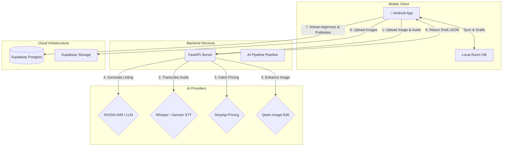

<p align="center">
  
</p>

<h1 align="center">KalaSetu 🇮🇳</h1>
<p align="center">
  <strong>Bridging the Gap Between Indian Artisans and the Digital Marketplace</strong>
</p>

<p align="center">
  <a href="#-download-apk">Download APK</a> •
  <a href="#the-problem">The Problem</a> •
  <a href="#our-solution">Our Solution</a> •
  <a href="#features">Features</a> •
  <a href="#architecture">Architecture</a> •
  <a href="#tech-stack">Tech Stack</a> •
  <a href="#getting-started">Getting Started</a>
</p>

<p align="center">
  <a href="release/kalasetu-app-debug.apk?raw=true"></a>
  
  
  
  
  
</p>

---

## 📱 Download APK

Want to test or use **KalaSetu** directly on an Android device? You can download the pre-compiled APK file right away without needing Android Studio or a local build environment:

<p align="center">
  <a href="release/kalasetu-app-debug.apk?raw=true">
    
  </a>
  &nbsp;&nbsp;
  <a href="https://github.com/jashwanthkandhi/KalaSetu/releases">
    
  </a>
</p>

### 📥 Download Links
- **Direct Repository File:** [`release/kalasetu-app-debug.apk`](release/kalasetu-app-debug.apk?raw=true)
- **GitHub Releases:** [KalaSetu Releases](https://github.com/jashwanthkandhi/KalaSetu/releases)

### 📲 Quick Install Guide for Android:
1. **Download:** Click the download button above on your Android phone (or download on PC and transfer to phone).
2. **Open:** Open the downloaded `.apk` file from your device notifications or `Files / Downloads` folder.
3. **Allow Unknown Sources:** If prompted with *"For your security, your phone is not allowed to install unknown apps from this source"*, tap **Settings** and toggle **"Allow from this source"**.
4. **Complete Setup:** Tap **Install**, then open KalaSetu!

---

## 🛑 The Problem

India is home to millions of talented artisans and craftsmen who create beautiful, authentic handmade products. However, they face a massive digital divide:
- **Low Digital Literacy:** Creating professional e-commerce listings requires writing catchy titles, detailed descriptions, and SEO tags.
- **Language Barriers:** Most e-commerce platforms are English-first, while artisans are most comfortable speaking in their native regional languages.
- **Pricing Uncertainty:** Artisans often struggle to accurately price their goods in a competitive online market.
- **High Friction:** Existing platforms have complex onboarding processes that alienate rural creators.

## 💡 Our Solution

**KalaSetu** (translating to "Bridge of Art") is a mobile-first cataloging application designed specifically for Indian artisans. It removes the friction of going digital by replacing typing with talking. 

An artisan simply:
1. **Snaps a photo** of their handicraft.
2. **Records a voice note** in their native language describing the item.
3. **Reviews** a completely generated, market-ready listing produced by our AI pipeline.

KalaSetu empowers creators to focus on their craft while AI handles the heavy lifting of e-commerce.

---

## ✨ Core Features

### 🛍️ Artisan-First Catalog Management
- **Smart Dashboard:** View real-time local catalog metrics, total products, and recent listings.
- **Robust Organization:** Filter by category/status, sort, and manage product details easily.
- **Offline-First Resilience:** Network drops? No problem. KalaSetu saves drafts locally via a Room Database and features an offline processing queue with automatic background sync.
- **Fail-Safe Publishing:** AI processes produce a *draft*. KalaSetu **never** publishes to the live marketplace without explicit artisan review and confirmation.

### 🤖 AI-Powered Workflow (FastAPI Backend)
- **Multilingual Transcription:** Built-in Sarvam/Whisper transcription accurately translates regional Indic voice notes (Telugu, Hindi, English) to text.
- **Generative Copywriting:** NVIDIA NIM / OpenAI models synthesize transcripts into compelling, professional descriptions, titles, and SEO tags.
- **Image Enhancement (Qwen):** Original product photos are analyzed and enhanced for a premium, well-lit e-commerce look.
- **Market Pricing Guidance:** Real-time SerpApi Google Shopping integration suggests fair, competitive market pricing to guide the artisan.

### ♿ Accessibility & Inclusivity
- **Adaptive UI:** Full support for system Light/Dark mode, dynamic text scaling, and high-contrast modes.
- **Text-to-Speech (TTS):** The app reads generated listings aloud using device TTS or Google TTS, ensuring artisans can verify AI outputs regardless of reading ability.

---

## 🏗️ Architecture & Workflow



## 🛠️ Tech Stack Deep Dive

### Frontend (Android)
- **Language:** Kotlin
- **UI Framework:** Jetpack Compose (Declarative UI)
- **Local Storage:** Room Database (SQLite) for offline-first capabilities.
- **Networking:** Retrofit & OkHttp

### Backend (API)
- **Framework:** FastAPI (Python 3.10+) for async, high-performance endpoints.
- **Architecture:** Modular service-based architecture with dependency injection.
- **Cloud Provider:** Supabase (PostgreSQL, Row Level Security, Cloud Storage).

### AI & Machine Learning
- **Transcription (STT):** Sarvam AI (Indic languages) with local Whisper fallback.
- **LLM/Generation:** NVIDIA NIM (Nemotron) for fast, structured JSON prompt generation.
- **Computer Vision:** MobileNet (ImageNet mapping) for fast categorization, and Qwen endpoints for image enhancement.

---

## 🚀 Getting Started

Follow these instructions to run the full stack locally.

### 1. Prerequisites
- **Android:** JDK 21 and Android SDK 36.
- **Python:** Python 3.10+ for the backend.
- **Database:** Supabase project or local Docker instance.

### 2. Backend Setup

```bash
# Navigate to the backend directory
cd backend

# Create and activate a virtual environment
python -m venv .venv
.\.venv\Scripts\activate  # Windows

# Install dependencies
pip install -r requirements.txt

# Configure environment secrets
cp .env.example .env
# ⚠️ Edit .env with your Supabase, NVIDIA NIM, and SerpApi keys. NEVER commit this file!

# Start the API server
python -m uvicorn app.main:app --host 0.0.0.0 --port 8000
```

### 3. Database Migration
1. Execute `supabase/schema.sql` to initialize tables.
2. Execute `supabase/product_expansion.sql` for additive updates.
3. *Note: Ensure your `listing-images` Supabase storage bucket is set to Public.*

### 4. Android App Setup
Open the app folder in Android Studio, or build via Gradle:

```bash
.\gradlew.bat assembleDebug
```
*Note: Debug builds default to the emulator IP (`http://10.0.2.2:8000/`). To run on a physical device, pass your LAN IP via `-PBACKEND_URL="http://<your-ip>:8000/"`.*

---

## 🔒 Security & Privacy

- **Data Minimization:** Local insights are calculated entirely on-device. Buyer views, orders, and sales are strictly isolated.
- **Anonymization:** Owner hashes, private transcripts, and emails are never exposed. Phone numbers are hidden unless explicitly toggled public.
- **Row Level Security (RLS):** All Supabase queries are protected by strict RLS policies and authenticated RPCs. 
- **Ephemeral Processing:** Voice transcripts and original images are processed in-memory and securely dropped after generation unless configured otherwise.

## 🧪 Testing

```bash
# Run Android Unit Tests & Linting
.\gradlew.bat testDebugUnitTest lintDebug

# Run Backend Pytest Suite
cd backend
pytest tests/ -q
```

---
<p align="center">Made with ❤️ for Indian Artisans.</p>
